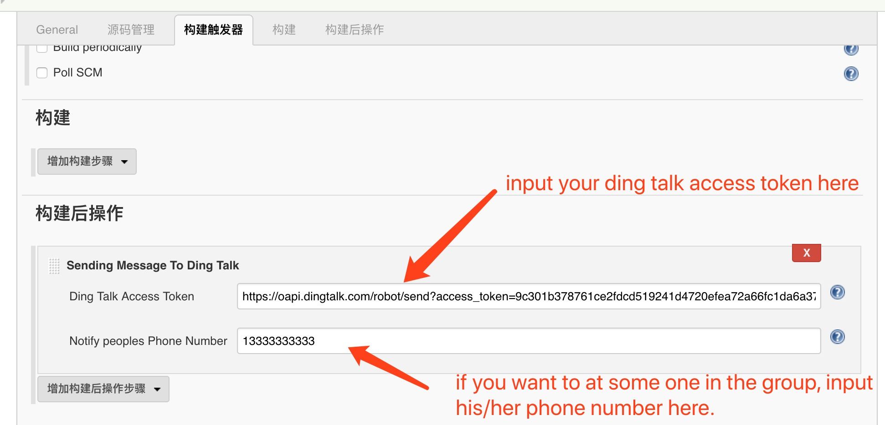

# Jenkins Ding Talk Plugin

push messages to ding talk 

This plugin currently can send markdown messages to ding talk which is a chat tool in China and notify specified person to read this message.

I plan to add more functions like sending any format message supported by ding talk and sending files to ding talk for example test reports.

